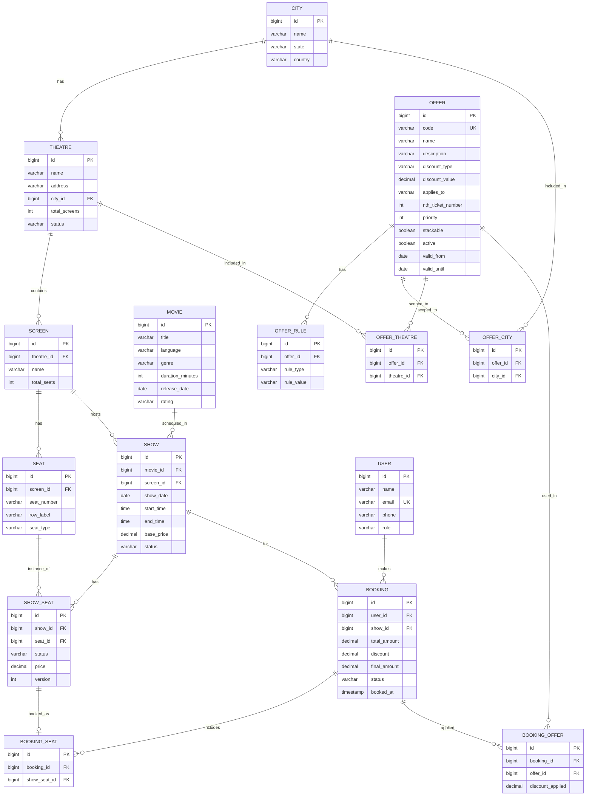

# Database Schema - Movie Ticket Booking Platform

> **To view diagram:** Open https://mermaid.live → clear editor → copy-paste the contents of `schema.mmd` (or the block below starting with `erDiagram`).

## ER Diagram



---

## Enum / Allowed Values

| Column | Allowed Values |
|---|---|
| `seat.seat_type` | REGULAR, PREMIUM, VIP |
| `show_seat.status` | AVAILABLE, BOOKED, BLOCKED |
| `show.status` | SCHEDULED, CANCELLED, COMPLETED |
| `theatre.status` | ACTIVE, INACTIVE |
| `user.role` | CUSTOMER, THEATRE_ADMIN |
| `booking.status` | PENDING, CONFIRMED, CANCELLED |
| `offer.discount_type` | PERCENTAGE, FLAT |
| `offer.applies_to` | PER_TICKET, PER_BOOKING, NTH_TICKET |
| `offer_rule.rule_type` | TIME_RANGE, DAY_OF_WEEK, MIN_TICKETS, MOVIE, LANGUAGE |

---

## Entity Summary

| Entity | Purpose |
|---|---|
| **city** | Master list of cities where platform operates |
| **theatre** | Theatre partner onboarded in a city |
| **screen** | Individual screens within a theatre |
| **seat** | Physical seats in a screen (master) |
| **movie** | Movie catalog |
| **show** | A scheduled instance of a movie on a screen |
| **show_seat** | Seat availability & pricing per show (pivot) |
| **user** | Platform users (customers + theatre admins) |
| **booking** | Booking transaction record |
| **booking_seat** | Seats included in a booking |
| **offer** | Configurable discount definition |
| **offer_rule** | Conditions that must be met for an offer to apply |
| **offer_city** | Cities where offer is valid (empty = all cities) |
| **offer_theatre** | Theatres where offer is valid (empty = all theatres) |
| **booking_offer** | Which offers were applied to a booking + discount amount |

---

## Offer Engine — How It Works

### The `offer` Table (WHAT the discount is)

| Column | Purpose |
|---|---|
| `code` | Unique identifier, e.g., `THIRD_TICKET_50` |
| `discount_type` | PERCENTAGE or FLAT |
| `discount_value` | 50 (means 50% or ₹50 depending on type) |
| `applies_to` | PER_TICKET / PER_BOOKING / NTH_TICKET |
| `nth_ticket_number` | e.g., 3 for "50% off 3rd ticket" |
| `priority` | Evaluation order when multiple offers match |
| `stackable` | Can it combine with other offers? |
| `valid_from / valid_until` | Activation window |

### The `offer_rule` Table (WHEN it applies)

Each offer can have multiple rules — ALL must pass for the offer to apply.

| rule_type | rule_value (JSON) | Meaning |
|---|---|---|
| `TIME_RANGE` | `{"start":"12:00","end":"17:00"}` | Show time between 12 PM and 5 PM |
| `DAY_OF_WEEK` | `{"days":["SAT","SUN"]}` | Weekend-only offer |
| `MIN_TICKETS` | `{"count":4}` | Minimum 4 tickets required |
| `MOVIE` | `{"movie_ids":[10,11]}` | Specific movies only |
| `LANGUAGE` | `{"languages":["HINDI"]}` | Specific languages |

### The `offer_city` / `offer_theatre` Tables (WHERE it applies)

- If **both empty** → offer applies everywhere
- If `offer_city` has rows → offer restricted to those cities
- If `offer_theatre` has rows → offer restricted to those theatres

### The `booking_offer` Table (WHAT was actually applied)

Stores the audit trail — for each booking, which offers were applied and how much discount each gave. Needed for:
- Customer invoice/receipt
- Refunds (revert the correct discount on cancellation)
- Analytics (which offers drive bookings)

---

## Seeded Offer Examples

### Offer 1: "50% off on the 3rd ticket"
```sql
INSERT INTO offer (code, name, discount_type, discount_value, applies_to, nth_ticket_number, priority, stackable, active)
VALUES ('THIRD_TICKET_50', '50% off on 3rd ticket', 'PERCENTAGE', 50, 'NTH_TICKET', 3, 1, true, true);
-- No offer_rule, offer_city, or offer_theatre rows → applies everywhere, always
```

### Offer 2: "20% off on afternoon shows"
```sql
INSERT INTO offer (code, name, discount_type, discount_value, applies_to, priority, stackable, active)
VALUES ('AFTERNOON_20', '20% off on afternoon shows', 'PERCENTAGE', 20, 'PER_BOOKING', 2, true, true);

INSERT INTO offer_rule (offer_id, rule_type, rule_value)
VALUES (LAST_INSERT_ID(), 'TIME_RANGE', '{"start":"12:00","end":"17:00"}');
```

### Offer 3 (example): "Flat ₹100 off at PVR theatres in Mumbai"
```sql
INSERT INTO offer (code, name, discount_type, discount_value, applies_to, priority, stackable, active)
VALUES ('MUMBAI_PVR_100', 'Flat ₹100 off at PVR Mumbai', 'FLAT', 100, 'PER_BOOKING', 3, false, true);

INSERT INTO offer_city (offer_id, city_id) VALUES (LAST_INSERT_ID(), 1);
INSERT INTO offer_theatre (offer_id, theatre_id) VALUES (LAST_INSERT_ID(), 5), (LAST_INSERT_ID(), 6);
```

---

## Discount Engine (Code Side)

```
DiscountEngine
  ├── fetchActiveOffers(booking.show, booking.theatre, booking.city, now)
  ├── for each offer (ordered by priority):
  │     ├── evaluate all offer_rules (TimeRangeEvaluator, DayOfWeekEvaluator, etc.)
  │     ├── if all rules pass → apply discount
  │     └── if stackable=false and already applied one → skip
  └── persist applied offers in booking_offer
```

Each `rule_type` is a Strategy implementation. New rule types can be added without changing the engine.

---

## Key Design Notes

### 1. `show_seat` Pivot Table
Each show dynamically generates rows for every seat in the screen. Enables:
- Per-show seat pricing
- Real-time seat availability
- Independent booking status per show

### 2. Concurrency Control
`show_seat.version` for **optimistic locking** via JPA `@Version`. Prevents double-booking.

### 3. Booking Flow
```
User selects show → Fetch show_seats (AVAILABLE) → User picks seats
  → Lock show_seats → Calculate discount via DiscountEngine
  → Create booking → Create booking_seats → Create booking_offers
  → Update show_seat.status = BOOKED → Commit
```

### 4. Indexes (for performance)
- `show (movie_id, show_date)` — browse shows by movie & date
- `show_seat (show_id, status)` — fetch available seats fast
- `theatre (city_id)` — filter theatres by city
- `booking (user_id, booked_at)` — user booking history
- `offer (active, valid_from, valid_until)` — fetch live offers

---

## Open Questions for Review
1. Should we model **payments** as a separate table (payment_id, gateway, txn_ref, status)? Recommended: **Yes**.
2. Do we need **seat hold/lock** as a separate table with TTL (e.g., 5 min hold before payment)? Recommended: **Yes** for realistic flow.
3. Should `user` support **authentication** (password_hash) or assume external auth (JWT from SSO)?
4. Do we need **audit columns** (created_at, updated_at, created_by) on all tables? Recommended: **Yes**.
